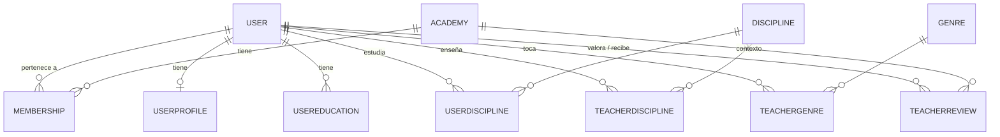

# SoundMate — Visión general del backend

Página inicial de la wiki. Resume **qué es SoundMate**, su **modelo de datos** (las entidades) y **cómo está construido**. Está en dos niveles: una parte **funcional** (para cualquiera) y otra **técnica** (para desarrollo).

---

## 🎯 ¿Qué es SoundMate?

SoundMate es el servicio principal (backend) de un **SaaS para profesores de música y academias**. Se encarga del **negocio y la identidad**: quién es quién, qué academias existen, quién pertenece a cada una, qué estudia y qué enseña cada persona.

La **gestión de horarios y reservas** vive en un microservicio aparte, **Agendia**. La frontera es clara:

- **SoundMate** → *quién es quién y qué relación tienen.*
- **Agendia** → *cuándo ocurren las clases.*

Cuando llega una reserva, SoundMate **valida** (¿este usuario pertenece a esta academia?) y **delega** en Agendia. Nunca duplica las reservas de Agendia, solo las referencia.

---

## 👥 Las entidades en lenguaje llano

### Identidad — quién es quién

- **Usuario (`User`)** — Una persona. Es **única y global**: un email = una persona en todo el sistema. Su nivel musical y su historial **viajan con ella** aunque cambie de academia. Nunca hace falta crear una cuenta nueva.
- **Academia (`Academy`)** — Una organización. Puede ser una **academia** con varios profesores, o un **profesor particular** (una "academia de una sola persona").
- **Membresía (`Membership`)** — La **relación** entre una persona y una academia, con su **rol** (Dueño, Profesor, Alumno, Staff). Es el **"ancla"**: existe en cuanto alguien tiene *cualquier* relación con una academia. Si un alumno se cambia de sitio, no se borra nada: se da de baja una membresía y se crea otra.

### Qué estudia cada alumno

- **Disciplina (`Discipline`)** — El **catálogo** de lo que se puede aprender: instrumentos (piano, guitarra, violín…) y materias (solfeo, armonía…). Hay **48** ya cargadas.
- **Nivel por disciplina (`UserDiscipline`)** — *"Pepito toca el piano a nivel Avanzado y la guitarra a nivel Principiante."* Una fila por instrumento. Un profesor que solo enseña (no estudia) simplemente no tiene ninguna.

### El perfil del profesor (estilo LinkedIn)

- **Perfil (`UserProfile`)** — Bio/descripción y foto. Lo puede tener cualquiera (un alumno también).
- **Educación (`UserEducation`)** — Títulos y diplomas: *"Grado en Piano, Conservatorio de Granada, 2015–2019."*
- **Especialidad** — Lo que un profesor **enseña**: disciplinas (`TeacherDiscipline`) + géneros (`TeacherGenre`). Ejemplo: enseña *guitarra eléctrica* con géneros *metal/rock*.
- **Género (`Genre`)** — El **catálogo** de estilos musicales (Clásico, Jazz, Flamenco, Metal…). Hay **33**.
- **Reseña (`TeacherReview`)** — Una valoración de **1 a 5 estrellas** que un usuario da a un profesor **dentro de una academia**. Las estrellas que se muestran son la **media** de todas las reseñas, nunca un número puesto a mano. Nadie puede valorarse a sí mismo.

---

## 🗺️ Cómo se relacionan

---

## 📖 Ejemplos concretos

- **Pepito, alumno con dos instrumentos** → un `User` y dos filas en `UserDiscipline`: (piano, Avanzado) y (guitarra, Principiante).
- **Pepito se cambia de academia** → se pausa/da de baja su `Membership` en la academia A y se crea otra en la B. Sigue siendo el **mismo `User`**, con su nivel intacto.
- **Profesor particular** → una `Academy` de tipo *SoloTeacher* cuyo dueño es el propio profesor.
- **Valoración** → tres alumnos valoran a un profe con 5, 4 y 4 estrellas → se muestra **"4,3 ★ · 3 reseñas"** (media calculada al vuelo).

---
---

## 🛠️ Parte técnica

### Arquitectura — Clean Architecture (4 capas)

Las dependencias apuntan en **una sola dirección**, de fuera hacia dentro:

| Capa | Responsabilidad | Depende de |
|---|---|---|
| **Domain** | Entidades, value objects, reglas de negocio | *(nada)* |
| **Application** | Casos de uso e **interfaces** de repositorio | Domain |
| **Infrastructure** | EF Core, repositorios, migraciones | Application |
| **API** | ASP.NET Core Web API | Application + Infrastructure |

### Patrones de dominio (DDD)

- **Dominio rico, no anémico**: las entidades se crean con *factories* (`User.Register`, `Academy.Create`) que **validan las invariantes**, y se modifican con métodos de negocio (`membership.Leave()` pone estado y fecha a la vez). **Nunca pueden estar en un estado inválido** — los errores saltan al crear, no al guardar.
- **Value Objects**: `Email` (valida el formato y normaliza para que `ana@` = `ANA@`) y `Slug`.
- **IDs fuertemente tipados** (`UserId`, `AcademyId`…): el compilador impide confundir un id de usuario con uno de academia.
- **Agregados referenciados por identidad** (por id, no por navegación) y **sin claves foráneas cruzadas** → facilita separar la base de datos por microservicio en el futuro.

### Stack tecnológico

- **.NET 10** / C#.
- **EF Core** (code-first) sobre **PostgreSQL** (proveedor **Npgsql**).
- Unicidad de email case-insensitive con el tipo **`citext`** de Postgres.
- **Patrón Repositorio + Unit of Work**, con inyección de dependencias (`AddInfrastructure`).

### Base de datos

- **11 tablas** + catálogos sembrados (**48 disciplinas**, **33 géneros**).
- Todo en **UTC** (`timestamp with time zone`).
- Reglas de integridad a nivel de BD: estrellas 1–5, años de educación coherentes, emails y slugs únicos.
- Los nombres van en **PascalCase con comillas** (`"Users"`), así que en SQL crudo hay que entrecomillarlos: `SELECT * FROM "Disciplines"`.

### Calidad y entrega

- **129 tests unitarios** de dominio (xUnit + Shouldly), cubren **cada invariante** (éxito y fallo), sin BD ni mocks.
- **CI** en GitHub Actions: build + tests en cada push.
- **Versionado SemVer**; versión actual: **`0.1.0`**.

### Tabla-resumen de las entidades

| Entidad | Qué representa | Clave |
|---|---|---|
| `User` | Persona única y global | email único (`citext`) |
| `Academy` | Academia o profesor particular | `AcademyType` |
| `Membership` | Persona ↔ academia + rol | el **"ancla"** |
| `Discipline` | Catálogo de instrumentos y materias | 48 sembradas |
| `UserDiscipline` | Nivel del alumno por disciplina | `MusicLevel` |
| `Genre` | Catálogo de géneros musicales | 33 sembrados |
| `UserProfile` | Bio y foto (1:1) | cualquiera |
| `UserEducation` | Títulos y diplomas (1:N) | rango de años |
| `TeacherDiscipline` | Disciplinas que **enseña** | especialidad (global) |
| `TeacherGenre` | Géneros que **enseña** | especialidad (global) |
| `TeacherReview` | Valoración 1–5 por academia | media **calculada** |

---

> **Estado actual (v0.1.0):** modelo de dominio completo, persistencia sobre PostgreSQL, repositorios e inyección de dependencias, y suite de tests. **Pendiente:** casos de uso de la capa de aplicación, endpoints de la API e integración con Agendia.
