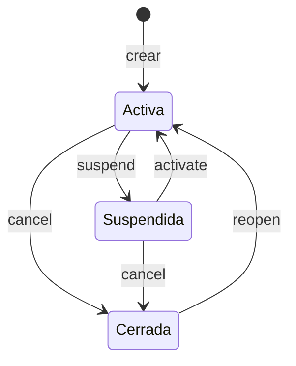

# SoundMate v0.2.0

La versión en la que SoundMate **empieza a hacer cosas**. La [v0.1.0](v0.1.0.md) tenía el modelo de
dominio y la base de datos, pero ni un solo endpoint de negocio: se sabía qué era un usuario y no
había forma de crear uno.

Esta trae la **capa de aplicación** entera y los endpoints de **usuarios** y **academias**, con su
ciclo de vida completo — incluido poder dar de baja algo y arrepentirse.

| | v0.1.0 | v0.2.0 |
|---|---|---|
| Endpoints de negocio | 0 | **25** |
| Tests | 129 | **387** |
| Migraciones | 1 | 3 |
| Casos de uso | — | usuarios y academias |

---

## Nivel funcional

### Qué se puede hacer ahora

**Con las personas:** registrarse, consultarse por id o por email, cambiar nombre y teléfono,
cambiar la contraseña, verificar el email, suspender y reactivar, darse de baja y volver.

**Con las academias:** crearlas, buscarlas por id, por su nombre público o por dueño, renombrarlas,
cambiar su identificador público, cambiar de plan, suspenderlas, reactivarlas, cerrarlas, reabrirlas,
darlas de baja y volver.

### Registrarse

Una persona da su email, una contraseña, su nombre y opcionalmente un teléfono. El email es su
**identidad global**: un email es una persona en todo SoundMate, y da igual cómo se escriba —
`Ana@Example.com` y `ana@example.com` son la misma.

La contraseña **nunca se guarda**. Se guarda un hash del que no se puede volver atrás, y la
contraseña en claro no llega ni siquiera al modelo de dominio.

Si el email ya está cogido, la respuesta lo dice claramente en vez de fallar de forma rara.

### Suspender y dar de baja no son lo mismo

Es la distinción más importante de esta versión, y aplica igual a personas y a academias.

| | Qué significa | Se ve en la API |
|---|---|---|
| **Suspender** | Una decisión sobre alguien **que sigue estando ahí**. Moderación. | Sí, con su estado |
| **Dar de baja** | La cuenta está **fuera**. Un hecho sobre el registro. | No, desaparece |

Que sean cosas separadas tiene una consecuencia concreta: **si suspendes a alguien, lo das de baja
y luego lo recuperas, vuelve suspendido**. La suspensión no se perdió por el camino. Si fueran un
único estado, recuperar tendría que adivinar a cuál volver.

### Nada se borra de verdad (salvo que lo pidas dos veces)

Dar de baja es **reversible**. La fila sigue existiendo, simplemente deja de aparecer: no la
encuentras por id, ni por email, ni en los listados, y no se puede modificar. Recuperarla la
devuelve **exactamente como estaba**.

Dos cosas que sorprenden y son deliberadas:

- **El email de una persona dada de baja sigue reservado.** No se puede registrar a nadie nuevo con
  él. Si se liberase, la persona nueva heredaría la identidad de la anterior — y ocho tablas siguen
  apuntando al usuario original.
- **El identificador público de una academia dada de baja sigue reservado**, por lo mismo: soltarlo
  haría que un enlace antiguo llevase a **otra** academia, que es peor que un enlace roto.

Existe además un **borrado permanente**, en su propia ruta para que nadie lo dispare por
descuido. Ese sí es irreversible, y se niega mientras queden relaciones colgando.

### Las academias y su dueño

Al crear una academia se dice quién es su dueño, y **en el mismo momento se le da su relación de
dueño con ella**. No es un detalle de implementación: en SoundMate la relación persona-academia es
lo que hace real cualquier vínculo, y es lo que se comprueba antes de reservar una clase. Una
academia cuyo dueño no le pertenece sería una contradicción desde el primer segundo.

El dueño tiene que existir y no estar dado de baja. Abrir una academia a nombre de una cuenta
cerrada crearía exactamente el tipo de dato huérfano que el borrado lógico existe para evitar.

### El identificador público (slug)

Cada academia tiene un nombre corto para URLs: `do-re-mi`, `julio-guitarra`. Solo minúsculas,
números y guiones sueltos. Se normaliza solo, así que `  DO-RE-MI  ` se guarda como `do-re-mi`.

**Se puede cambiar, pero tiene su propio endpoint a propósito.** Cambiarlo rompe todos los enlaces
existentes y libera el anterior para que otra academia lo tome — con lo que un enlace viejo puede
acabar llevando a un sitio distinto. Demasiado consecuente para que ocurra como efecto colateral de
editar el nombre.

### Los estados de una academia



**Cerrada** (`cancel`) es el estado de negocio: se acabó la suscripción, o la escuela echó el
cierre. Mientras está cerrada no se puede tocar nada — ni el nombre, ni el slug, ni el plan — pero
**se sigue pudiendo consultar**, porque su histórico, su facturación y las reseñas de cuando
funcionaba no dejan de existir.

Y se puede **reabrir**. Un cliente que vuelve y paga otra vez es lo más normal del mundo, y sin
reabrir no habría forma de devolverle su academia: su slug seguiría ocupado por ella misma.

> **Reabrir solo deshace un cierre.** Una academia *suspendida* sigue suspendida después de
> reabrirla. Levantar una suspensión es lo que hace `activate`, y si reabrir hiciera las dos cosas
> bastaría con cerrar y reabrir para saltarse una decisión de moderación.

### Los dos "deshacer", que se parecen y no son lo mismo

| Quieres deshacer… | Llama a… |
|---|---|
| un **cierre** (`cancel`) | `reopen` |
| una **baja** (`delete`) | `restore` |

Confundirlos es fácil, así que la API lo dice: pedir `reopen` sobre algo dado de baja responde
*"está dado de baja; recupéralo primero — reopen deshace un cierre, restore deshace una baja"*, en
vez de un escueto "no encontrado".

Se pueden encadenar: cerrar → dar de baja → recuperar (sigue cerrada) → reabrir (activa otra vez).

---

## Nivel técnico

### La capa de aplicación

```
Controller → Service → Repository
```

Sin MediatR y sin AutoMapper. Las dos decisiones se tomaron mirando datos, no preferencias.

**MediatR.** Agendia lo usa con la cadena `Controller → MediatR → Handler → Service → Repository`.
Al contar su código: **61 requests y 61 handlers, 969 líneas en total** — unas 16 por archivo,
contando `using`, `namespace`, clase y constructor. La lógica real de casi todos son 1-3 líneas
reenviando a uno de 30 servicios. Y behaviors hay **uno**. Son 122 archivos para ganar un sitio
donde enganchar la validación, que aquí lo da un action filter de 30 líneas.

El problema no es MediatR: es tener **handler *y* servicio**, que paga su precio sin usar lo que
ofrece, porque el handler —donde MediatR quiere el caso de uso— está vacío.

**AutoMapper.** Se intentó usar y saltó `NU1903`: [GHSA-rvv3-g6hj-g44x](https://github.com/advisories/GHSA-rvv3-g6hj-g44x),
DoS por recursión, CVSS 7.5.

| Versión | Licencia | Advisory |
|---|---|---|
| 12.0.1 *(la que usa Agendia)* | MIT | **afectada** |
| 14.0.0 | MIT | **afectada** |
| 15.1.1 / 16.1.1+ | comercial | parcheada |

**El parche solo existe pasado el punto en que dejó de ser MIT.** Y no estaba aportando nada: con
IDs tipados y value objects había que declarar todos los miembros a mano igualmente. El mapeo son
métodos de extensión estáticos, y sale ganando — los DTO de respuesta usan `required`, así que
**olvidar un campo no compila** (`error CS9035`), en vez de quedarse en su valor por defecto hasta
que alguien ejecute la validación de configuración.

### Validación

FluentValidation, ejecutada por un `ValidationFilter` global — el equivalente al `ValidationBehavior`
de MediatR. No se usa `FluentValidation.AspNetCore`: se quedó en la 11.3.1 y nunca siguió a la 12.

**Una regla, un sitio.** Un validador no reescribe una regla del dominio: el value object la expone
y el validador la llama (`Email.IsValid`, `Slug.IsValid`).

Esto salió de un bug real. El `.EmailAddress()` de FluentValidation solo exige una `@` con algo a
cada lado, así que `missing@domain` pasaba el validador y **luego** reventaba en `Email.Create`,
cuyo regex sí exige punto. El caller recibía una invariante lanzada en vez del 400 con detalle por
campo que el validador existe para dar. Hay un test que compara las dos rutas entrada por entrada,
así que volver a divergir se pone rojo.

### Errores

Un `IExceptionHandler` global traduce a `ProblemDetails`:

| Excepción | HTTP |
|---|---|
| `ValidationException`, `DomainException` | 400 |
| `UserNotFoundException`, `AcademyNotFoundException` | 404 |
| `EmailAlreadyRegisteredException`, `SlugAlreadyTakenException` | 409 |
| `UserStillHasMembershipsException`, `AcademyStillHasMembersException` | 409 |
| `AcademyIsDeletedException` | 409 |
| cualquier otra | 500 con detalle **genérico** |

El caso por defecto es deliberado: el mensaje real va al log, no a la respuesta. Ahí es por donde
se filtran connection strings.

### El borrado lógico

Una columna `DeletedAtUtc` nullable, **independiente del estado de negocio**, con un **índice
parcial** `WHERE "DeletedAtUtc" IS NULL` — Postgres solo indexa el conjunto vivo, que es el que
consultan todas las lecturas normales.

Una fecha y no un booleano porque *cuándo* es lo que necesita cualquier política de retención.

El propio dominio se defiende: `EnsureNotDeleted()` en cada mutador, siguiendo el patrón que ya
tenían `Membership.EnsureNotLeft()` y `Academy.EnsureNotCancelled()`. Un borrado lógico que te deja
seguir editando el registro no es un borrado.

Las lecturas y las mutaciones responden **"no existe"**, no "está borrado" — decir lo segundo
filtraría que la cuenta existe. Solo las operaciones de ciclo de vida ven más allá.

### Contraseñas

PBKDF2 con HMAC-SHA256 y **600.000 iteraciones**, formato autodescriptivo
`pbkdf2-sha256$<iteraciones>$<salt>$<hash>` — el mismo que usa Agendia para los secretos de
servicio. Que las iteraciones viajen dentro de cada hash importa: subirlas después deja todos los
hashes existentes verificables en vez de dejar a todo el mundo fuera.

Seis veces las de Agendia a propósito. Su hasher protege secretos de máquina, que son cadenas
aleatorias largas; este protege contraseñas que la gente elige y reutiliza, así que el coste de
cómputo tiene que cargar con el peso que no lleva la entropía. La comparación es en tiempo
constante.

**Cambiar la contraseña exige la actual y la comprueba.** Sin eso, poder llegar al endpoint sería
lo mismo que ser dueño de la cuenta.

### La carrera de los índices únicos

`ExistsByEmailAsync` seguido de `AddAsync` **no es atómico**: dos peticiones a la vez pasan las dos
la comprobación y el índice único rechaza a la perdedora con un `23505` de Postgres que, sin
capturar, sale como **500** — un fallo de servidor por lo que en realidad es la misma respuesta que
daba la comprobación.

`UnitOfWork` es el **único sitio** que sabe qué significa ese código: lo traduce a
`UniqueConstraintViolationException` para que la capa de aplicación pueda reaccionar sin referenciar
ni EF Core ni Npgsql. Los servicios la capturan **comprobando el nombre del índice**, para que un
futuro segundo índice único en la tabla no empiece a reportarse como un email o un slug duplicado.

Aplica igual a `IX_Users_Email` y a `IX_Academies_Slug`.

### Enums

Viajan **por nombre** (`"SoloTeacher"`, no `2`) gracias a un `JsonStringEnumConverter` global; los
números se siguen aceptando de entrada. Los valores numéricos son un detalle de almacenamiento
—explícitos justo para que reordenar el enum no corrompa datos— y el contrato HTTP no debe
heredarlos.

Con eso registrado, los DTO llevan **enums de verdad, no strings**: mismo JSON, más tipo en C# y
valores documentados en OpenAPI. Como esa registración vive en otro proyecto y nadie más la echaría
de menos, `JsonContractTests` comprueba el JSON serializado directamente — si alguien quita el
converter, fallan esos tests en vez de todos los consumidores.

### Endpoints

**Usuarios**

| Método | Ruta | Notas |
|---|---|---|
| `POST` | `/api/users` | 201 + `Location` · 409 si el email está cogido |
| `GET` | `/api/users/{id}` | |
| `GET` | `/api/users?email=` | ⚠️ oráculo de enumeración; tras política de admin cuando haya auth |
| `PUT` | `/api/users/{id}` | nombre y teléfono; **ni email ni contraseña** |
| `PUT` | `/api/users/{id}/password` | exige la contraseña actual |
| `POST` | `/api/users/{id}/verify-email` | |
| `POST` | `/api/users/{id}/suspend` · `/reactivate` | |
| `DELETE` | `/api/users/{id}` | baja **reversible** |
| `POST` | `/api/users/{id}/restore` | |
| `DELETE` | `/api/users/{id}/permanent` | irreversible · 409 si tiene membresías |

**Academias**

| Método | Ruta | Notas |
|---|---|---|
| `POST` | `/api/academies` | crea también la membresía de dueño, en el mismo commit |
| `GET` | `/api/academies/{id}` · `/by-slug/{slug}` · `?ownerId=` | |
| `PUT` | `/api/academies/{id}` | solo el nombre |
| `PUT` | `/api/academies/{id}/slug` | endpoint propio: rompe enlaces |
| `PUT` | `/api/academies/{id}/plan` | cambio de valor, sin reglas de negocio todavía |
| `POST` | `/api/academies/{id}/suspend` · `/activate` · `/cancel` · `/reopen` | |
| `DELETE` | `/api/academies/{id}` | baja **reversible** |
| `POST` | `/api/academies/{id}/restore` | |
| `DELETE` | `/api/academies/{id}/permanent` | irreversible · 409 si tiene miembros |

**Otros**

| Método | Ruta | Notas |
|---|---|---|
| `GET` | `/api/version` | producto y versión del build en marcha |
| `GET` | `/api/agendia/connection` | solo en Development |

### Migraciones

| Migración | Qué hace |
|---|---|
| `InitialIdentity` | 11 tablas + catálogos sembrados |
| `UserSoftDelete` | `Users.DeletedAtUtc` + índice parcial |
| `AcademySoftDelete` | `Academies.DeletedAtUtc` + índice parcial |

No se aplican al arrancar: `dotnet ef database update` desde el host.

### Tests

**387**, repartidos en tres proyectos: dominio (218), aplicación (159) e infraestructura (10).

`SoundMate.Application.Tests` usa **fakes escritos a mano, sin librería de mocking**, igual que los
de infraestructura. `FakeUnitOfWork.FailWithUniqueViolationOn` existe para alcanzar el camino de la
carrera perdida, que no se reproduce solo con datos en memoria.

Tres tests merecen mención porque no comprueban comportamiento sino que **protegen decisiones**:

- `UserDtoTests` fija la lista exacta de propiedades del DTO y rechaza cualquier nombre con
  `password`, `hash`, `secret` o `token`. Añadir un campo al DTO obliga a declararlo a conciencia.
- `JsonContractTests` fija el JSON que sale por el cable.
- `Email.IsValid_AgreesWithCreate` y su gemelo en `Slug` comparan las dos rutas de validación
  entrada por entrada.

### Lo que esta versión NO trae

- **Autenticación.** Todas las rutas están abiertas. Cualquiera puede abrir una academia a nombre de
  otro o consultar si un email existe. Es asumible mientras no haya nada desplegado y es lo primero
  que hay que cerrar.
- **El puente con Agendia** (`Academy` → `Business`). La conexión máquina-a-máquina funciona y está
  probada, pero aprovisionar todavía no. La pregunta difícil no es cómo llamar, sino qué pasa si
  Agendia no responde: los dos servicios divergirían sin que nadie lo detecte hasta que alguien
  intente reservar.
- **Membresías más allá del ancla.** Se crea la del dueño; invitar, cambiar rol y salir no están.
- **El perfil de enseñanza** (bio, titulaciones, especialidad, reseñas): el dominio existe desde la
  v0.1.0, los casos de uso no.
- **Cascadas de borrado.** El borrado permanente deja huérfanas filas en otras tablas, y por eso se
  niega mientras haya relaciones. Quiere un cascade de verdad antes de usarse en serio.
